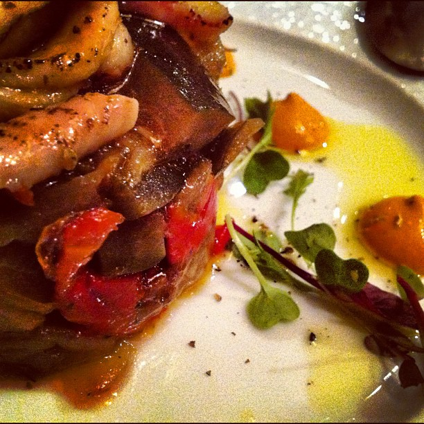

# Contribute
Here it is a how-to for contributing to the ustwo recipe book.

## Everyone

### Credit where credit is due

Chances are that you want to publish a recipe that you have not invented yourself. Big chef or small blog, please give credit where credit is due.

This includes images as well, by the way. If you don't have the time to shoot a proper picture don't just grab the first one that appears in Google Images. For example, in Flickr you can search for pictures with Creative Commons licenses only, use those. [Hot-linking](http://en.wikipedia.org/wiki/Inline_linking) is not considered good etiquette either, so please download the image and add it to the images folder (see below). 

### Editing Markdown

[Markdown](http://en.wikipedia.org/wiki/Markdown) is simple enough that can be edited by hand on any text editor. However, if you prefer a little bit of help, you can use [Mou](http://mouapp.com/) a very simple editor for Mac (please get in touch if you have recommendations for good editors for Windows and Linux).

If you need some help with the syntax keep either [John Gruber](http://daringfireball.net/projects/markdown/syntax)'s or [Github](https://help.github.com/articles/github-flavored-markdown)'s cheat-sheets at hand.

Worst case scenario just write the recipe in plain text and ask one of the developers for help.

### Images

As mentioned above, do not hot-link images from other websites, download them to the images folder instead. Give them a meaningul name, ideally related to the recipe and then embed them in your recipe like this:

```

```

Remember to add a mention in the acknowledgments section.

## Technical people

If you are a developer just fork and send a pull request per recipe, you know the drill : )

## Non-technical people

First of all, kudos for at least trying! 

If you are worried about breaking things, don't be. Yes, you *can* break things, but if for some reason you have managed to do BAD THINGS we can always revert your changes. 

Now for beef!

* Create an account at [Github](https://github.com/). Ask Juan, Victor or Gianpi to add you to the repository.
* Install a GIT client, for example Github's ([Mac](http://mac.github.com/), [Windows](http://windows.github.com/)). 
* Launch it and, when asked, install the command line tools. Login with the user you create on the first step.
* If everything went ok, under GITHUB.COM you should see an ustwo icon. Click it and on the right hand side select ```recipe-book```. Click it and select where you do you want to clone it (that means downloading it). 
* When done, click on the repository name which should now appear at the top under ```Cloned Repositories```.

At this point you can have a click around through the sections. You can safely ignore Branches and Settings, let's have a look at the others.

### History

History gives you an indication of who's done what and when. When you click one of the commits (group of changes), on the right hand side you see what that change was about. Sometimes is adding new files (recipes), sometimes just fixing types, etc.

### Changes

This where you can create your own commits, ie, adding a new recipe. If you have not created your recipe by now, do it. 

Create an empty file with the recipe name. Use the name of the recipe as the file name (English characters only, replace spaces with "_") and ```.md``` as the extension. 

If you go back to the Changes section the icon should be coloured now and the new file should appear there, selected and marked as "new".

Go now and write down your lovely recipe. Once you are done go back to the Changes section, it's time for your first commit!

Add a summary and an extendend description if you feel like it. For example:

**Good**
> Summary: Adding the first version of my potato salad, yay!
> 
> Extended description: Boy, that took a while, but I'm so happy I now know my way around Github : )

**Bad**
> Summary: change
>
> Extended description:

Now press the Commit button, it should appear now below under ```Unsynced Commits```.

Last step! Press the Sync button… et voila! You have published your first recipe.