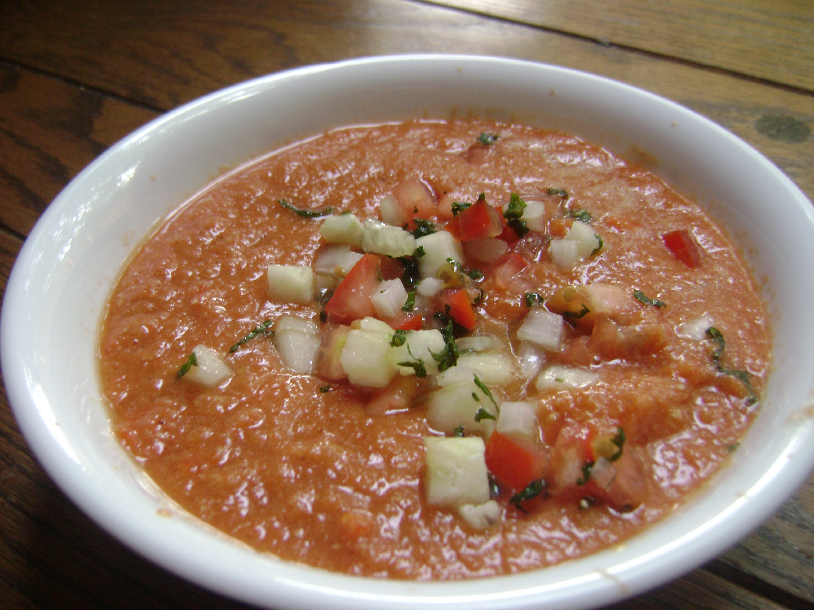

# Gazpacho

## Intro

Gazpacho is awesome.

Particularly good in South Spain where people make litres of it and keep it bottled up in the fridge so they can pour a glass when they come from the street as if it were water.

## Ingredients

* 8 ripe tomatoes
* 1 cucumber
* 1/2 red pepper
* 1/4 green pepper
* 1/2 onion
* 1/2 apple (yes, apple!)
* 2 garlic cloves 
* Olive oil, vinegar, salt
* Bread (optional)

## How to do it

Give a good rinse and clean to all the ingredients, peel the apple and if you peel the tomatoes you'll get a smoother gazpacho.

Cut everything in chunks and throw it to the blender. Give it a good bash and when it's liquid enough season with the olive oil, vinegar and salt. Spin it, taste it and repeat the process until you are happy with the seasoning (which is quite personal).

Optional: if you put it through a sieve you'll remove all the seeds and peels left, getting a much, much smoother version.

If you have bread to add do it now and put the whole thing again through the blender (don't do this before going through the sieve though!).

Bottle it for easy serving and cool it down in the fridge for say 1 hour, but anything would do.

Enjoy.

## Tips and tricks

Tomatoes make a huge difference, so don't be cheap with them. However, if you need quick and dirty, you can use unseasoned canned tomatoes.

It can be served as a starter, just put it in bowl, cut in small chunks some more tomatoes, cucumber, peppers and onion and sprinkle them on top with a bit of olive oil and parsley. 

If it's really, really hot it can be served with a couple of ice cubes.

Once you have the basic version, play around with more or less seasoning, garlic, etc.

Lasts good 4/5 days in the fridge.

## Related

Salmorejo.

## Alergies and dietary requirements

* Nuts free
* Gluten free
* Milk free
* Vegetarian

## Acknowledgments

Thanks [Tomatoes and Friends](http://www.flickr.com/photos/tomatoesandfriends/4812761687/) for the pic (used under license).