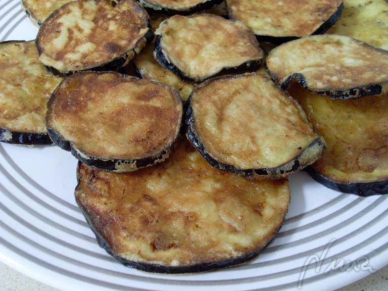

# Non-greasy deep fried aubergines

## Intro

It can be done, but it ain't easy. Well, it's not rocket science either, it's just a bit... cumbersome. However, the end result is well worth it.

## Ingredients

* 1 aubergine
* 1 egg
* flour
* salt

## How to do it

Wash and dry up the aubergine, remove the top. Grab a colander and put a deep plate underneath.

Start cutting the aubergine into thin slices. Arange the first few as a layer in the colander and add plenty of salt (don't worry, trust me). Keep slicing up and arranging layers in the colander, adding salt to each layer. 

Let it rest for good 30-35 minutes.

What is going to happen now is that the aubergine is going to slowly exude a fair amount liquid. Reason #1 why the result is going to be crispy.

After approx. 30 mins, throw away the liquid that oozed out of the aubergine, give each slice a good rinse under cold water and lay them on a double layer of kitchen paper. Once you have rinsed them all, add another layer of kitchen paper on top and give them a good tap to absorb all the remaining moisture.

Grab a frying pan, add olive oil and bring it to a very high temperature.

While the oil heats up, whisk the egg and batter the slices. But before you start deep frying them, find an oven grill rack ([this](https://www.google.co.uk/search?q=oven+grill+rack&safe=off&client=firefox-a&hs=WwG&rls=org.mozilla:en-US:official&source=lnms&tbm=isch&sa=X&ei=rbWbUraHBsq10wX2Ow&ved=0CAkQ_AUoAQ&biw=1177&bih=882) is what I mean) to rest the slices on once fried. **Do not use kitchen paper**. That is reason #2 why the end result is non-greasy. Yes, kitchen paper absorbs the excess olive oil but it becomes moist and warm, leaving the aubergine soggy underneath.

So, your aubergine is battered, your olive oil is piping hot and the grill rack is waiting as the final destination. Now go ahead, but don't add more than 3-4 slices at a time, it would make the oil's temperature drop too much. They should be done in no more than 3-4 minutes.

And that's it! The first ones to come out would probably be ready to eat by the time you finish with the last ones.

Enjoy.

## Allergies and dietary requirements

* Vegetarian
* Gluten free (if you use gluten free flour!)

## Acknowledgments

I Googled a bit and read a few recipes, but this one is mostly out of [this blog](http://azulpurpuranuria.blogspot.co.uk/2008/09/berenjenas-fritas-crujientes.html) (in Spanish, thanks for the picture as well).
