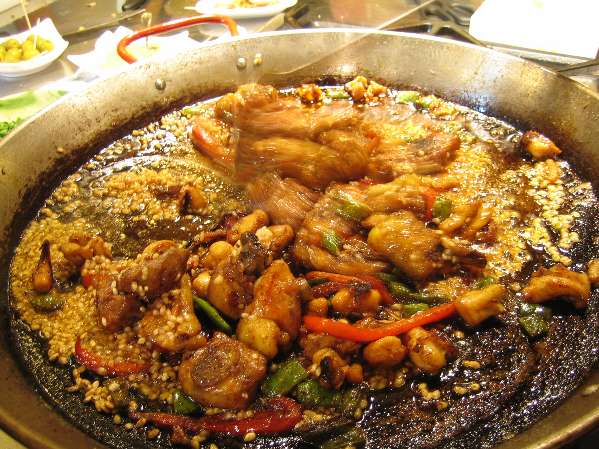

# Paella

## Intro

Right, despite being Spanish, I can't claim to be a paella expert (surprise). However, I know enough to know where to look for one. Guess what? I won't look at Gordon Freaking Ramsey and [his paella with chorizo](http://www.tastebook.com/recipes/2143486-Gordon-Ramsay-s-perfect-paella), for example.

After watching him doing **that** I totally lost faith on any big chef claiming traditional dishes from countries they really have no clue about. I would listen to them, but then go and find someone local with real knowledge.

Which brings us to issue of finding a reputable source for the paella recipe. For those who don't know, paella originates in Valencia, East Spain. The problem is that the dish has been completely bastardized to no end, even by Spanish people.

Why? 

Well, rice is so versatile that it goes with anything. Don't chorizo and rice go together? Indeed they do, but it's not a paella. Nothing against it, but don't call it a paella because it's not.

Every dish might have some variations, but there are things that simply are a no-no-no.

## How to do it

Head to [WikiPaella](http://wikipaella.org/) where they are preparing a full website dedicated to paella and roll all over it.

In the mean time, I'll only say this: paella is very simple dish. I won't give you the recipe here, but if it has anything other than rice, vegetables, chicken or rabbit, it's got every chance to be wrong or fake. No seafood and **strictly no freaking chorizo**.

## Acknowledgments

Thanks to [Brett](http://www.flickr.com/photos/83096974@N00/24694866/) for the picture (used under license), although it claims to have pork and seafood. Grrrr, see??? So much damage has been done already : (

