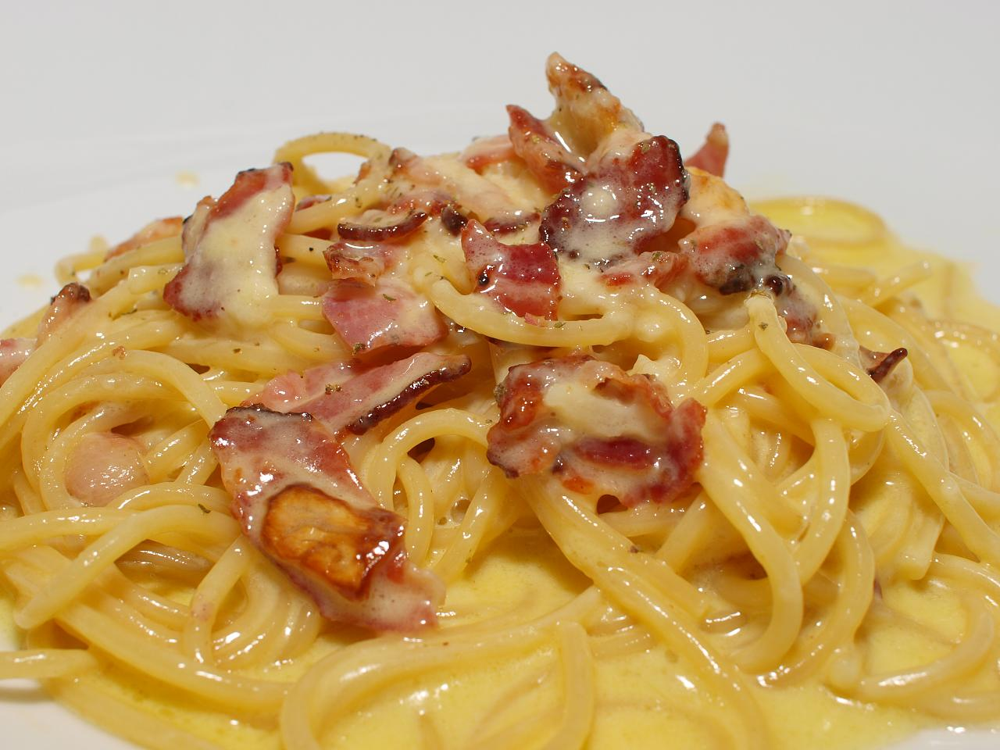

# Pasta alla carbonara

## Intro

Pasta alla carbonara (not "Pasta carbonara" as you can read in most touristic menus around the world) is probably one of the most popular dishes in Italy.
Probably just because of its popularity, it's also one of the most screwed-up-by-foreigners-and-italians-abroad recipes.

## Ingredients (2 people)

* 160g pasta, preferably spaghetti
* Guanciale (quantity according to taste)
* 2 eggs
* Grated pecorino romano (quantity according to taste)
* Salt, ground black pepper

## How to do it

Bring 2 liters of water to boil, then add 20g of salt. Cook the pasta for around 2 minutes less than the time you read on the box.

In the meantime put a pan on moderate heat and start cooking the guanciale: it will fry in its own fat, so don't add any oil or butter. Cook the guanciale as crispy as you like, then turn the heat off.

In a bowl big enough to serve the pasta, whisk the 2 eggs with pecorino, salt and pepper. The texture should be creamy, but not very thick.

Once the pasta is cooked, turn the heat back on the guanciale, drain the pasta and toss it with the guanciale for about 1 minute.
Then pour the pasta, the guanciale and its fat in the bowl where you whisked the eggs, and stir thoroughly: the heat coming from the pasta and the guanciale will cook the eggs just enough to make it creamy.

Serve straightaway, and feel free to finish it off with some more grated pecorino and black pepper.

## Tips and tricks

Pour pasta and guanciale in the bowl with the eggs, and not the other way around. The pan is too hot and will cook the eggs, resulting in a wrong texture, more similar to a frittata.

If you can't find Guanciale, you could replace it with pancetta cubes.

If you like yolks better than the whites, you can use 1 whole egg plus 1 yolk per person, instead of 1 whole egg per person.

Do NOT use cream. If you use cream in pasta alla carbonara you will die.

## Related

Pasta all'amatriciana.

## Allergies and dietary requirements

* Nut free

## Acknowledgements

Thanks [Gaku.](http://www.flickr.com/photos/95926172@N00/2731501672/) for the pic (used under license).
