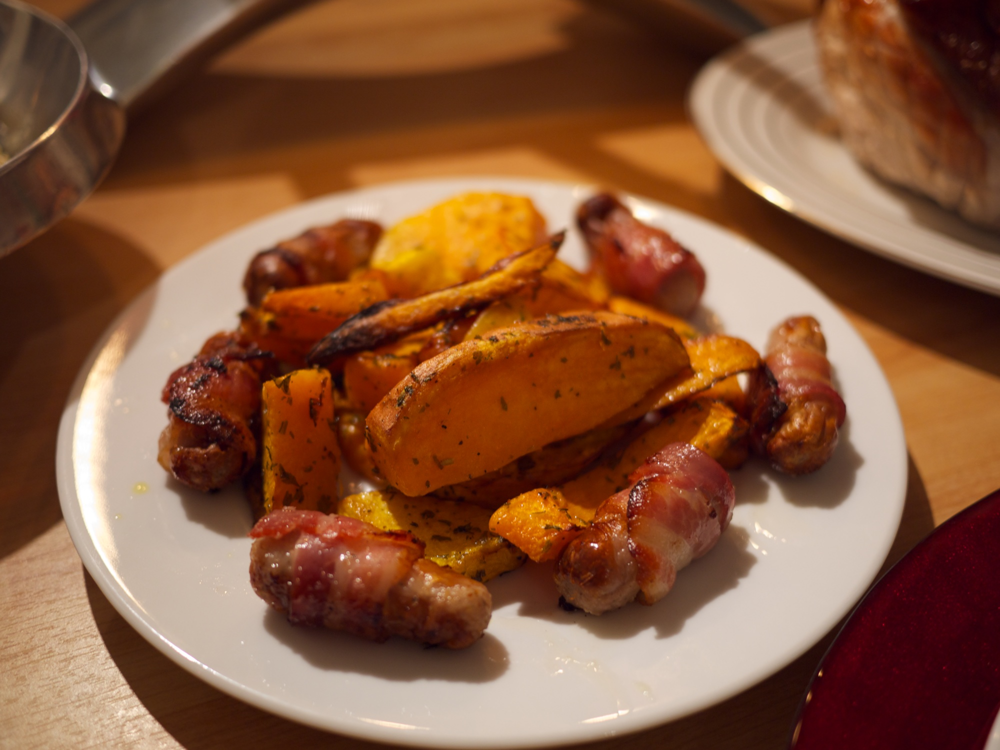

# Roasted sausages with squash

## Intro

You know you can cook pumpkins? Go figure. There is a reason why they are used in Halloween and it is because they are in season, like their cousin the squash.

Kudos to Tesco for the original [recipe](http://realfood.tesco.com/recipes/roast-sausages-with-squash-red-onion-and-crispy-sage.html).

## Ingredients

* 1 squash
* 6 sausages
* 1 red onion
* 3 carrots
* salt
* sage
* olive oil

## How to do it

Pre-heat the oven at 220 degrees.

Peel and seed out the squash, cut in wedges. Same for the onion and the carrots just cut them in big chunks.

Put everything in the roasting pan, drizzle the olive oil, the sage and a bit of salt. Prickle the sausages and put them on top.

Now there is not much to do, keep the whole thing in the oven for 40 minutes, stirring every 20 minutes so all the ingredients are evenly roasted.

## Tips and tricks

If when you open for stirring some vegs are burning just sprinkle some water before putting it back in the oven (thank Jamie Oliver for that one).

You can boil basmati rice, finely chop a couple of garlic cloves and sage and give it a quick stirr in a pan with olive oil to use it as a filler or side.

## Related

Dunno.

## Allergies and dietary requirements

* Gluten free (if you use gluten free sausages!)
* Lactose free
* Nuts free

## Acknowledgments

Thanks to [Richard Gaywood](http://www.flickr.com/photos/richardgaywood/5207137903/) for the picture (used under license).
